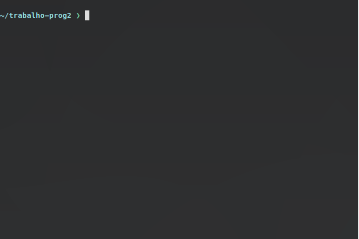

#### O que faz este script?
- Roda seu programa uma vez para cada arquivo de teste.
- Compara (via ```diff``` ) as saídas do seu programa com as saídas fornecidas para teste.
- Mostra uma mensagem de alerta caso alguma saída esteja com problemas.

#### O script funciona mesmo que eu ainda não tenha implementado todos os itens do trabalho?
- Sim! O script reconhece os itens que você implementou e compara apenas tais itens com os testes públicos.

#### E como utilizar?
1. Baixe o script para a mesma pasta onde está o seu programa. Você pode clicar [neste link](https://raw.githubusercontent.com/juarezjan/prog2_trabalho_autotest/master/autotest.sh) com o botão direito e depois em *Salvar como...*
2. Edite o "nome_do_arquivo" que está na sexta linha do script e substitua pelo nome do seu programa. Essa é a única modificação que você precisará fazer.
3. Torne o script executável com o seguinte comando:
```
chmod +x autotest.sh
```
4. Crie uma pasta chamada *testes_publicos* dentro da pasta onde está o seu programa.
5. Baixe a bateria de testes que está disponível no AVA -- https://ava.ufes.br/mod/forum/discuss.php?d=24503 -- e extraia dentro da pasta que você criou.
6. Agora basta executar:
```
./autotest.sh
```

#### Você poderia dar uma demonstração do funcionamento?

